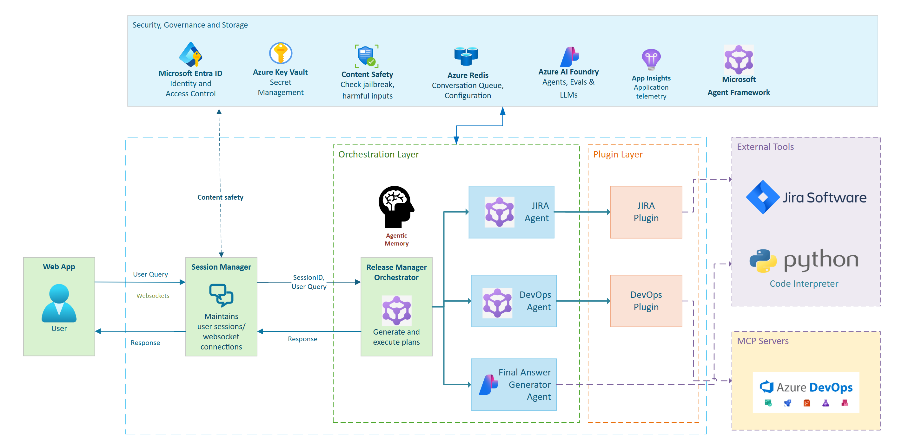

  <h1>
    Release Manager
  </h1>
  
<strong>Transforming software delivery process with intelligent agent orchestration</strong>

   
  
<a href="https://placeholder-for-rma-demo-video.com">▶️ Watch Demo Video</a>

[**SOLUTION OVERVIEW**](#solution-overview) \| [**QUICK DEPLOY**](#quick-deploy) \| [**BUSINESS SCENARIO**](#business-scenario) \| [**SUPPORTING DOCUMENTATION**](#supporting-documentation)

 

<h2>
SOLUTION OVERVIEW
</h2>

In modern software development, **Release Managers** play a pivotal role bridging the gap between development and operations. As the orchestrators of software deployment, they ensure that releases are timely, efficient, and risk-mitigated. However, increasing complexity and fragmentation across systems have made this role more challenging than ever.

The **Release Manager Assistant (RMA)** is a solution accelerator designed to augment release managers with AI-driven intelligence, multi-system integration, and real-time decision support. It simplifies the release lifecycle from planning to post-deployment analysis, all through a unified and contextual interface.

---

## 🧠 Solution Architecture

The architecture is built on a modular and secure AI-native design leveraging:

- **Multi-Agent Orchestration System**: Intelligent planning agent that coordinates between:
  - **JIRA Agent**: Handles customer issues with JQL optimization and custom field support
  - **Azure DevOps Agent**: Manages Azure DevOps work items via MCP with comprehensive tool discovery *(replaces deprecated database-backed DevOps Agent)*
  - **Visualization Agent**: Creates interactive charts and graphs using code interpreter capabilities
  - **Planner Agent**: Routes queries intelligently based on user intent and system capabilities  
  - **Fallback Agent**: Provides graceful degradation when services are unavailable
- **Azure AI Foundry Service**: Cloud-based agents with integrated tools (Code Interpreter, SharePoint)
- **Semantic Kernel Framework**: Advanced agent orchestration, memory management, and plugin integration
- **Model Context Protocol (MCP)**: Standardized Azure DevOps integration with auto-discovery of tools and capabilities
- **Azure Key Vault & Azure Storage**: Secure secret and data management with encrypted credential storage
- **Redis Integration**: Session management and message queuing for scalable operations

<h2>
QUICK DEPLOY
</h2>

> **Note**: This solution accelerator is designed to be highly adaptable. You can customize integrations, agent behaviors, and workflows based on your internal tooling landscape and organizational needs.

For detailed setup instructions, please follow the guide here: [SETUP INSTRUCTIONS](SETUP.md)

### Prerequisites

- **Azure Subscription** with appropriate permissions
- **Access to Azure OpenAI and Azure AI Foundry** services
- **Local/Cloud instance for JIRA** with API access and custom field configuration
- **Azure DevOps organization access** with work item, build, and release permissions
- **Node.js 20+** (required for Azure DevOps MCP Server)
- **Python >= 3.12** for agent runtime
- **Docker runtime** for running service containers locally (For more information on local execution, refer to this guide: [LOCAL EXECUTION IN DOCKER](../../DOCKER.README.md))
- **Visual Studio Code** with Python extension (recommended for development)

### Quick Start Options

1. **Docker Deployment** (Recommended): Use pre-configured VS Code tasks for containerized deployment
2. **Local Development**: Full debugging capabilities with VS Code launch configurations  
3. **Production Setup**: Azure-hosted deployment with proper secret management

---

<h2>
BUSINESS SCENARIO
</h2>

### 🧩 Key Challenges

- ❌ Fragmented release data across platforms
- ❌ Lack of real-time release health visibility
- ❌ High manual effort in compiling readiness reports
- ❌ Difficulty managing cross-team/service dependencies
- ❌ Visualizing complex data across multiple systems

### ✅ Key Features

#### 🔄 Release Planning & Coordination

- **Intelligent Agent Orchestration**: Multi-agent system with smart planning that routes queries to appropriate agents (JIRA, DevOps, Visualization, Fallback)
- **Real-time dependency mapping and release health assessment**: Seamless integration between JIRA issues and Azure DevOps work items
- **Advanced Visualization**: Interactive charts, graphs, and visual analysis using code interpreter capabilities
- **Cross-Release Tracking**: Query and visualize data across multiple releases with intelligent filtering

#### 🕓 Scheduling & Readiness Automation

- **Release Timeline Analysis**: Intelligent forecasting and delivery date estimation
- **Confirmation-based Updates**: Safe update mechanisms with user confirmation before making changes

#### 🌐 Cross-System Collaboration

- **Enhanced MCP Integration**: Comprehensive Azure DevOps integration via Model Context Protocol with:
  - Work item management (create, read, update, search)
  - Build and release tracking
  - Repository and project information
  - Team and iteration management
  - Pull request tracking
- **Flexible Authentication**: Support for both Azure CLI and Personal Access Token authentication
- **JIRA Deep Integration**: Custom field support, JQL optimization, and secure credential handling
- **Unified, contextual insights**: Data synthesis from disparate systems with intelligent agent coordination

---

<h2>
SUPPORTING DOCUMENTATION
</h2>

### 🔗 Integrations Supported

- **[JIRA SDK](https://jira.readthedocs.io/)** - Complete JIRA API integration with custom field support
- **[JIRA API](https://developer.atlassian.com/cloud/jira/platform/rest/v3/)** - Direct REST API access with JQL optimization
  > ⚠️ **Warning:** Jira Plugin uses HTTP BASIC authentication which is not recommended for Production workloads. Ensure token auth is configured.
- **[Azure DevOps MCP Server](https://github.com/microsoft/azure-devops-mcp)** - Comprehensive Model Context Protocol integration featuring:
    - Work Items (create, read, update, search, batch operations)
    - Builds and Releases (status tracking, artifact management)
    - Repositories and Pull Requests (code change tracking)
    - Teams and Iterations (project management)
    - Search capabilities across all Azure DevOps entities
  > ⚠️ **Warning:** Azure DevOps API access is subject to user permissions. Please make sure right permissions are configured to access all features/tools exposed as part of the MCP server.
- **[Microsoft Graph API](https://learn.microsoft.com/en-us/graph/overview)** - Enterprise notifications and identity management
- **[Azure AI Foundry](https://ai.azure.com/doc/azure/ai-foundry/agents/overview)** - Cloud-based agent services with code interpreter capabilities
- **Redis** - Session management and message queuing for scalable operations

---

##  🔧 Troubleshooting Guide

Below are solutions for common issues encountered when setting up or running the Release Manager Assistant:

### 🔄 Environment and Setup Issues

| Issue | Solution |
|-------|----------|
| **VS Code debugging not working** | Ensure the PYTHONPATH environment variable is set correctly in launch.json and the correct Python interpreter is selected. |

### 🔌 Integration and Connection Issues

| Issue | Solution |
|-------|----------|
| **"Failed to authenticate with Azure DevOps"** | Check your PAT token expiration and/or user credentials  and permissions. Ensure AZURE_DEVOPS_EXT_PAT environment variable is set correctly or Azure CLI is authenticated. |
| **"JIRA API connection failed"** | Verify your JIRA server URL, username, and password in the .env file. Check network connectivity and firewall settings. |
| **WebSocket connection errors** | Check that Session Manager is started before accessing the frontend. Verify Redis is running and accessible. |

### 🖥️ Frontend Issues

| Issue | Solution |
|-------|----------|
| **React/Vite build errors** | For Node.js version conflicts, try using Node.js version 16+ for better compatibility. Reinstall dependencies with `npm install` in the frontend directory. |
| **"Failed to load resource" errors in browser** | Check browser console for specific error messages. *Ensure Session Manager is running before accessing the frontend.* |
| **Blank or unresponsive UI** | Verify WebSocket connection to Session Manager is established. |

### 🚨 Agent and Orchestration Issues

| Issue | Solution |
|-------|----------|
| **"No response from agent"** | Check logs for timeout errors. |
| **Missing visualization data** | Verify Azure storage account is configured with correct settings. |

If you continue experiencing issues, please open an issue on the repository with detailed logs and reproduction steps.

---

## 📄 License

This project is licensed under the MIT License. See [LICENSE](./LICENSE) for details.

---

## Responsible AI Transparency FAQ
Please refer to [Transparency FAQs](./TRANSPARENCY_FAQ.md) for responsible AI transparency details of this solution accelerator.

---

## 📚 Additional Resources

- [Azure AI Foundry Agent Service](https://ai.azure.com/doc/azure/ai-foundry/agents/overview)
- [Azure AI Foundry - Code Interpreter](https://learn.microsoft.com/en-us/azure/ai-services/agents/how-to/tools/code-interpreter)
- [Microsoft Agent Framework](https://github.com/microsoft/agent-framework)

---

## Disclaimers

To the extent that the Software includes components or code used in or derived from Microsoft products or services, including without limitation Microsoft Azure Services (collectively, "Microsoft Products and Services"), you must also comply with the Product Terms applicable to such Microsoft Products and Services. You acknowledge and agree that the license governing the Software does not grant you a license or other right to use Microsoft Products and Services. Nothing in the license or this ReadMe file will serve to supersede, amend, terminate or modify any terms in the Product Terms for any Microsoft Products and Services. 

You must also comply with all domestic and international export laws and regulations that apply to the Software, which include restrictions on destinations, end users, and end use. For further information on export restrictions, visit https://aka.ms/exporting. 

You acknowledge that the Software and Microsoft Products and Services (1) are not designed, intended or made available as a medical device(s), and (2) are not designed or intended to be a substitute for professional medical advice, diagnosis, treatment, or judgment and should not be used to replace or as a substitute for professional medical advice, diagnosis, treatment, or judgment. Customer is solely responsible for displaying and/or obtaining appropriate consents, warnings, disclaimers, and acknowledgements to end users of Customer's implementation of the Online Services. 

You acknowledge the Software is not subject to SOC 1 and SOC 2 compliance audits. No Microsoft technology, nor any of its component technologies, including the Software, is intended or made available as a substitute for the professional advice, opinion, or judgment of a certified financial services professional. Do not use the Software to replace, substitute, or provide professional financial advice or judgment.  

BY ACCESSING OR USING THE SOFTWARE, YOU ACKNOWLEDGE THAT THE SOFTWARE IS NOT DESIGNED OR INTENDED TO SUPPORT ANY USE IN WHICH A SERVICE INTERRUPTION, DEFECT, ERROR, OR OTHER FAILURE OF THE SOFTWARE COULD RESULT IN THE DEATH OR SERIOUS BODILY INJURY OF ANY PERSON OR IN PHYSICAL OR ENVIRONMENTAL DAMAGE (COLLECTIVELY, "HIGH-RISK USE"), AND THAT YOU WILL ENSURE THAT, IN THE EVENT OF ANY INTERRUPTION, DEFECT, ERROR, OR OTHER FAILURE OF THE SOFTWARE, THE SAFETY OF PEOPLE, PROPERTY, AND THE ENVIRONMENT ARE NOT REDUCED BELOW A LEVEL THAT IS REASONABLY, APPROPRIATE, AND LEGAL, WHETHER IN GENERAL OR IN A SPECIFIC INDUSTRY. BY ACCESSING THE SOFTWARE, YOU FURTHER ACKNOWLEDGE THAT YOUR HIGH-RISK USE OF THE SOFTWARE IS AT YOUR OWN RISK.
